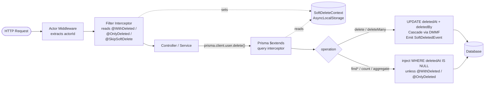

# @nestarc/soft-delete

[](https://www.npmjs.com/package/@nestarc/soft-delete)
[](https://www.npmjs.com/package/@nestarc/soft-delete)
[](https://github.com/nestarc/nestjs-soft-delete/actions/workflows/ci.yml)
[](https://opensource.org/licenses/MIT)
[](https://nestarc.dev/packages/soft-delete/)

> **A NestJS-first soft-delete toolkit for Prisma.**
> Adds cascade, restore, purge, lifecycle events, route decorators, and actor tracking around a Prisma client extension.

[Quick Start](#quick-start) · [Why this library?](#why-nestarcsoft-delete) · [How It Works](#how-it-works) · [API Reference](#api-reference) · [Docs](https://nestarc.dev/packages/soft-delete/)

---

## Why @nestarc/soft-delete?

Many Prisma soft-delete libraries are framework-agnostic — they work, but they leave NestJS users to wire up request-scoped filter context, route decorators, and event handling by hand. `@nestarc/soft-delete` is designed for NestJS first:

- **NestJS-native** — `forRoot()` / `forRootAsync()`, DI tokens, interceptors, middleware, and `@nestjs/event-emitter` integration out of the box
- **Async-safe filter context** — `AsyncLocalStorage`-backed filter modes per request, automatically wired by route decorators
- **Explicit DMMF injection** — configure cascade metadata when `Prisma.dmmf` is unavailable, including Prisma versions where it is no longer auto-exposed
- **Safety guardrails** — `maxCascadeDepth` guard, timestamp-matched cascade restore, typed errors, dual ESM/CJS

### Comparison with alternatives

| Feature | `@nestarc/soft-delete` | `prisma-extension-soft-delete` | `prisma-soft-delete-middleware` |
|---|:-:|:-:|:-:|
| NestJS module (`forRoot` / `forRootAsync`) | ✅ | ❌ | ❌ |
| Route decorators (`@WithDeleted` / `@OnlyDeleted` / `@SkipSoftDelete`) | ✅ | ❌ | ❌ |
| `AsyncLocalStorage` request context | ✅ | ❌ | ❌ |
| Lifecycle events (deleted / restored / purged) | ✅ | ❌ | ❌ |
| `purge()` API for retention policies | ✅ | ❌ | ❌ |
| Cascade soft-delete | ✅ | ✅ | ✅ |
| Cascade restore (timestamp-matched) | ✅ | see project docs | see project docs |
| Actor tracking (`deletedBy`) | ✅ | ✅ | ✅ |
| Explicit cascade DMMF override | ✅ | see project docs | see project docs |
| Testing utilities | ✅ | ❌ | ❌ |
| ESM + CJS dual build | ✅ | ✅ | ✅ |

If you do not use NestJS, `prisma-extension-soft-delete` is a great choice. If you do, this library saves you from building the integration layer yourself.

---

## Table of Contents

- [Why @nestarc/soft-delete?](#why-nestarcsoft-delete)
- [Features](#features)
- [Installation](#installation)
- [Quick Start](#quick-start)
- [How It Works](#how-it-works)
- [Configuration](#configuration)
- [Decorators](#decorators)
- [Cascade Configuration](#cascade-configuration)
- [Events](#events)
- [Purge (Scheduled Hard-Delete)](#purge-scheduled-hard-delete)
- [Testing](#testing)
- [Unique Constraint Strategy](#unique-constraint-strategy)
- [Standalone Usage](#standalone-usage)
- [Performance](#performance)
- [FAQ / Troubleshooting](#faq--troubleshooting)
- [API Reference](#api-reference)
- [License](#license)

---

## Features

- 🪶 **Prisma extension rewrite** — `delete` and `deleteMany` automatically become `update` / `updateMany` setting `deletedAt`
- 🔍 **Transparent query filtering** — `findMany`, `findFirst`, `findUnique`, `count`, `aggregate`, `groupBy` exclude soft-deleted rows by default
- 🌊 **Cascade soft-delete & restore** — across related models, with timestamp-matched restore semantics
- ↩️ **Three deletion strategies** — `restore()`, `forceDelete()`, and `purge()` on `SoftDeleteService`
- 🎯 **Route-level filter control** — `@WithDeleted()`, `@OnlyDeleted()`, `@SkipSoftDelete()` decorators
- 👤 **Actor tracking** — automatic `deletedBy` via `actorExtractor`
- 📡 **Lifecycle events** — `SoftDeletedEvent`, `RestoredEvent`, `PurgedEvent` via `@nestjs/event-emitter`
- 🧪 **Testing utilities** — `TestSoftDeleteModule`, `expectSoftDeleted`, `expectNotSoftDeleted`, `expectCascadeSoftDeleted`
- ⚡ **Explicit DMMF injection** — configure cascade metadata when Prisma does not expose `Prisma.dmmf`
- 🔌 **Standalone usable** — `createPrismaSoftDeleteExtension()` works without NestJS
- 🌐 **Global module** — register once, use everywhere

---

## How It Works

A request flows through NestJS → middleware → interceptor → controller → the Prisma extension. The extension intercepts both write and read operations using the request-scoped `SoftDeleteContext` to decide what to do:



- **`SoftDeleteActorMiddleware`** extracts the actor ID from the incoming request via `actorExtractor`.
- **`SoftDeleteFilterInterceptor`** reads route metadata (`@WithDeleted`, `@OnlyDeleted`, `@SkipSoftDelete`) and stores the filter mode in `SoftDeleteContext` (an `AsyncLocalStorage` store) for the rest of the async chain.
- **The Prisma extension** consults `SoftDeleteContext` on every operation: write operations are rewritten to `UPDATE`s setting `deletedAt` (and optionally `deletedBy`), and read operations get a `deletedAt` filter injected.
- **Cascade** walks the configured parent → children graph using Prisma DMMF metadata, with `maxCascadeDepth` as a safety bound.
- **Events** fire after each soft-delete / restore / purge for downstream audit, notifications, or replication.

---

## Installation

```bash
npm install @nestarc/soft-delete
# or
yarn add @nestarc/soft-delete
# or
pnpm add @nestarc/soft-delete
```

**Required peer dependencies** (install if not already present):

```bash
npm install @nestjs/common @nestjs/core @prisma/client reflect-metadata rxjs
```

**Optional integrations:**

```bash
# For lifecycle events
npm install @nestjs/event-emitter

# For scheduled purge jobs
npm install @nestjs/schedule
```

---

## Quick Start

### 1. Prisma schema

Add `deletedAt` (and optionally `deletedBy`) to every model you want to soft-delete:

```prisma
model User {
  id        Int      @id @default(autoincrement())
  email     String   @unique
  name      String
  deletedAt DateTime?
  deletedBy String?
}
```

### 2. Set up PrismaService

Apply the soft-delete extension in your `PrismaService`. This is what intercepts `delete()` calls and injects query filters:

```typescript
// prisma.service.ts
import { Injectable, OnModuleInit } from '@nestjs/common';
import { PrismaClient } from '@prisma/client';
import { createPrismaSoftDeleteExtension } from '@nestarc/soft-delete';

@Injectable()
export class PrismaService extends PrismaClient implements OnModuleInit {
  private _extended: ReturnType<typeof this.$extends>;

  constructor() {
    super();
    this._extended = this.$extends(
      createPrismaSoftDeleteExtension({
        softDeleteModels: ['User', 'Post'],
        deletedAtField: 'deletedAt',
        deletedByField: 'deletedBy',
        cascade: { User: ['Post'] },
      }),
    );
  }

  // Expose the extended client for all queries
  get client() {
    return this._extended;
  }

  async onModuleInit() {
    await this.$connect();
  }
}
```

> **Important:** Use `prisma.client.user.delete()` (the extended client) for soft-delete behavior.
> Direct `prisma.user.delete()` calls bypass the extension and perform hard deletes.

### 3. Register the module

```typescript
// app.module.ts
import { Module } from '@nestjs/common';
import { SoftDeleteModule } from '@nestarc/soft-delete';
import { PrismaService } from './prisma.service';

@Module({
  imports: [
    SoftDeleteModule.forRoot({
      softDeleteModels: ['User', 'Post'],
      deletedAtField: 'deletedAt',
      deletedByField: 'deletedBy',
      actorExtractor: (req) => req.user?.id ?? null,
      prismaServiceToken: PrismaService,
    }),
  ],
  providers: [PrismaService],
})
export class AppModule {}
```

`SoftDeleteModule` is global — you do not need to import it in feature modules.

### 4. Use in a controller

```typescript
// users.controller.ts
import { Controller, Delete, Get, Param, Post } from '@nestjs/common';
import { SoftDeleteService, WithDeleted } from '@nestarc/soft-delete';
import { PrismaService } from './prisma.service';

@Controller('users')
export class UsersController {
  constructor(
    private readonly prisma: PrismaService,
    private readonly softDelete: SoftDeleteService,
  ) {}

  // Soft-deletes the user (sets deletedAt) via the extended client
  @Delete(':id')
  remove(@Param('id') id: string) {
    return this.prisma.client.user.delete({ where: { id: +id } });
  }

  // Normal findMany — deleted users are automatically excluded
  @Get()
  findAll() {
    return this.prisma.client.user.findMany();
  }

  // Include soft-deleted users in results
  @Get('all')
  @WithDeleted()
  findAllIncludingDeleted() {
    return this.prisma.client.user.findMany();
  }

  // Restore a soft-deleted user
  @Post(':id/restore')
  restore(@Param('id') id: string) {
    return this.softDelete.restore('User', { id: +id });
  }
}
```

---

## Configuration

All options for `SoftDeleteModule.forRoot()`:

| Option | Type | Default | Description |
|---|---|---|---|
| `softDeleteModels` | `string[]` | — | **Required.** Model names to enable soft-delete for. |
| `deletedAtField` | `string` | `'deletedAt'` | Prisma field that stores the soft-delete timestamp. |
| `deletedByField` | `string \| null` | `null` | Prisma field to store the actor ID who deleted the record. |
| `actorExtractor` | `(req: any) => string \| null` | `undefined` | Function to extract the actor ID from the incoming request. |
| `cascade` | `Record<string, string[]>` | `undefined` | Parent-to-children cascade map (see Cascade section). |
| `maxCascadeDepth` | `number` | `3` | Maximum depth for recursive cascade operations. |
| `dmmf` | `PrismaDmmfLike` | `undefined` | Explicit Prisma DMMF metadata for cascade relation lookup. When omitted, cascade falls back to `Prisma.dmmf` if available; pass this explicitly when your Prisma version does not expose `Prisma.dmmf`. |
| `prismaServiceToken` | `any` | — | **Required.** DI token of your `PrismaService`. |
| `enableEvents` | `boolean` | `false` | Emit lifecycle events. Requires `@nestjs/event-emitter`. |

### Async registration

```typescript
SoftDeleteModule.forRootAsync({
  imports: [ConfigModule],
  prismaServiceToken: PrismaService,
  useFactory: (config: ConfigService) => ({
    softDeleteModels: config.get('SOFT_DELETE_MODELS').split(','),
    deletedAtField: 'deletedAt',
    prismaServiceToken: PrismaService,
  }),
  inject: [ConfigService],
});
```

---

## Decorators

Apply to controller route handlers to change the filter mode for that request.

### `@WithDeleted()`

Include soft-deleted records alongside active ones.

```typescript
@Get('trash-and-active')
@WithDeleted()
findAll() {
  return this.prisma.client.post.findMany();
}
```

### `@OnlyDeleted()`

Return only soft-deleted records.

```typescript
@Get('trash')
@OnlyDeleted()
findTrashed() {
  return this.prisma.client.post.findMany();
}
```

### `@SkipSoftDelete()`

Bypass soft-delete logic entirely — `delete` performs a real hard-delete.

```typescript
@Delete(':id/hard')
@SkipSoftDelete()
hardDelete(@Param('id') id: string) {
  return this.prisma.client.post.delete({ where: { id: +id } });
}
```

---

## Cascade Configuration

Define parent-to-children relationships to automatically cascade soft-delete and restore operations.

```typescript
SoftDeleteModule.forRoot({
  softDeleteModels: ['User', 'Post', 'Comment'],
  cascade: {
    User: ['Post'],
    Post: ['Comment'],
  },
  maxCascadeDepth: 3,
  prismaServiceToken: PrismaService,
});
```

When a `User` is soft-deleted, matching non-deleted `Post` records are soft-deleted automatically, and each affected post's matching `Comment` records are soft-deleted as well. Restoring the `User` restores timestamp-matched cascade records up to `maxCascadeDepth` levels deep.

### Prisma 7 cascade metadata

Cascade relation lookup requires Prisma DMMF metadata. Prisma 5 and 6 expose this through `Prisma.dmmf`, so no extra configuration is required in the default client setup. Prisma 7 does not expose `Prisma.dmmf` in the same way, so pass DMMF explicitly when using cascade:

```typescript
import { readFileSync } from 'node:fs';
import { getDMMF } from '@prisma/internals';
import { SoftDeleteModule } from '@nestarc/soft-delete';
import { PrismaService } from './prisma.service';

SoftDeleteModule.forRootAsync({
  prismaServiceToken: PrismaService,
  useFactory: async () => {
    const datamodel = readFileSync('prisma/schema.prisma', 'utf8');
    const dmmf = await getDMMF({ datamodel });

    return {
      softDeleteModels: ['User', 'Post'],
      cascade: {
        User: ['Post'],
      },
      dmmf,
      prismaServiceToken: PrismaService,
    };
  },
});
```

`@nestarc/soft-delete` does not depend on `@prisma/internals`; install and use it in your application only if you choose this DMMF generation approach. Prisma versions outside the published peer dependency range should be treated as explicit-DMMF usage until the package is tested against them and the peer dependencies are updated.

---

## Events

Enable events and install `@nestjs/event-emitter`:

```bash
npm install @nestjs/event-emitter
```

```typescript
// app.module.ts
import { EventEmitterModule } from '@nestjs/event-emitter';

@Module({
  imports: [
    EventEmitterModule.forRoot(),
    SoftDeleteModule.forRoot({
      softDeleteModels: ['User', 'Post'],
      enableEvents: true,
      prismaServiceToken: PrismaService,
    }),
  ],
})
export class AppModule {}
```

Listen to events with `@OnEvent()`:

```typescript
import { Injectable } from '@nestjs/common';
import { OnEvent } from '@nestjs/event-emitter';
import { SoftDeletedEvent, RestoredEvent, PurgedEvent } from '@nestarc/soft-delete';

@Injectable()
export class AuditListener {
  @OnEvent(SoftDeletedEvent.EVENT_NAME)
  onDeleted(event: SoftDeletedEvent) {
    console.log(`${event.model} soft-deleted by ${event.actorId} at ${event.deletedAt}`);
  }

  @OnEvent(RestoredEvent.EVENT_NAME)
  onRestored(event: RestoredEvent) {
    console.log(`${event.model} restored by ${event.actorId}`);
  }

  @OnEvent(PurgedEvent.EVENT_NAME)
  onPurged(event: PurgedEvent) {
    console.log(`${event.count} ${event.model} records purged (older than ${event.olderThan})`);
  }
}
```

| Event class | `EVENT_NAME` | Payload fields |
|---|---|---|
| `SoftDeletedEvent` | `soft-delete.deleted` | `model`, `where`, `deletedAt`, `actorId` |
| `RestoredEvent` | `soft-delete.restored` | `model`, `where`, `actorId` |
| `PurgedEvent` | `soft-delete.purged` | `model`, `count`, `olderThan` |

---

## Purge (Scheduled Hard-Delete)

Use `SoftDeleteService.purge()` with `@nestjs/schedule` to permanently remove old soft-deleted records on a schedule.

```bash
npm install @nestjs/schedule
```

```typescript
import { Injectable } from '@nestjs/common';
import { Cron, CronExpression } from '@nestjs/schedule';
import { SoftDeleteService } from '@nestarc/soft-delete';

@Injectable()
export class PurgeService {
  constructor(private readonly softDelete: SoftDeleteService) {}

  @Cron(CronExpression.EVERY_DAY_AT_MIDNIGHT)
  async purgeOldRecords() {
    const thirtyDaysAgo = new Date(Date.now() - 30 * 24 * 60 * 60 * 1000);

    const users = await this.softDelete.purge('User', { olderThan: thirtyDaysAgo });
    const posts = await this.softDelete.purge('Post', { olderThan: thirtyDaysAgo });

    console.log(`Purged ${users.count} users, ${posts.count} posts`);
  }
}
```

`purge()` also accepts an optional `where` for additional filtering:

```typescript
await this.softDelete.purge('Post', {
  olderThan: thirtyDaysAgo,
  where: { authorId: userId },
});
```

---

## Testing

Import `TestSoftDeleteModule` from `@nestarc/soft-delete/testing` in your unit or integration tests.

```typescript
import { Test } from '@nestjs/testing';
import { TestSoftDeleteModule, expectSoftDeleted, expectNotSoftDeleted, expectCascadeSoftDeleted } from '@nestarc/soft-delete/testing';
import { SoftDeleteService } from '@nestarc/soft-delete';
import { createPrismaSoftDeleteExtension } from '@nestarc/soft-delete';
import { PrismaClient } from '@prisma/client';

describe('UsersService', () => {
  let softDelete: SoftDeleteService;
  let prisma: any; // your extended PrismaClient in tests

  beforeAll(async () => {
    prisma = new PrismaClient().$extends(
      createPrismaSoftDeleteExtension({ softDeleteModels: ['User', 'Post'] }),
    );

    const module = await Test.createTestingModule({
      imports: [
        TestSoftDeleteModule.register(
          { softDeleteModels: ['User', 'Post'] },
          prisma,
        ),
      ],
    }).compile();

    softDelete = module.get(SoftDeleteService);
  });

  it('soft-deletes a user', async () => {
    await prisma.user.delete({ where: { id: 1 } });
    await expectSoftDeleted(prisma.user, { id: 1 });
  });

  it('restores a user', async () => {
    await softDelete.restore('User', { id: 1 });
    await expectNotSoftDeleted(prisma.user, { id: 1 });
  });

  it('cascades soft-delete to posts', async () => {
    await prisma.user.delete({ where: { id: 2 } });
    await expectCascadeSoftDeleted(prisma, 'User', { id: 2 }, ['Post']);
  });
});
```

### Assertion helpers

| Helper | Description |
|---|---|
| `expectSoftDeleted(delegate, where, deletedAtField?)` | Asserts the record exists and `deletedAt` is non-null. |
| `expectNotSoftDeleted(delegate, where, deletedAtField?)` | Asserts the record exists and `deletedAt` is null. |
| `expectCascadeSoftDeleted(prisma, parentModel, where, childModels, deletedAtField?)` | Asserts the parent and all listed child models have soft-deleted records. |

### Project validation

The package test suite has two layers:

```bash
npm test
npm run test:e2e
```

`npm test` covers the unit-level module, context, extension, cascade, event, and testing-helper behavior. `npm run test:e2e` runs against PostgreSQL and covers cascade soft-delete, cascade restore, purge, lifecycle events, and the full NestJS HTTP stack. The E2E suite creates its tables with raw SQL and runs files serially because each file shares the same test database.

CI runs lint, unit tests, build, and PostgreSQL E2E tests. Tagged releases also run the PostgreSQL E2E suite before `npm publish`.

---

## Unique Constraint Strategy

Standard `@unique` constraints continue to count soft-deleted rows, so reusing a value such as an email can fail after soft-delete. There is no fully portable Prisma-schema-only solution for "unique among active rows"; use a database-specific unique index for the active subset.

For PostgreSQL, add a partial unique index in a migration:

```sql
CREATE UNIQUE INDEX users_email_active_unique
  ON "User" ("email")
  WHERE "deletedAt" IS NULL;
```

For SQLite, use the same partial-index idea with your actual table and column names. For MySQL, use a generated column or functional index strategy that only has a value for active rows. Avoid relying on `@@unique([email, deletedAt])`: in databases where `NULL` values are treated as distinct, that composite index can allow multiple active rows with the same email because active rows all have `deletedAt = NULL`.

---

## Standalone Usage

Use `createPrismaSoftDeleteExtension()` without NestJS — useful in scripts, tests, or non-NestJS projects:

```typescript
import { PrismaClient } from '@prisma/client';
import { createPrismaSoftDeleteExtension } from '@nestarc/soft-delete';

const prisma = new PrismaClient().$extends(
  createPrismaSoftDeleteExtension({
    softDeleteModels: ['User', 'Post', 'Comment'],
    deletedAtField: 'deletedAt',
    deletedByField: 'deletedBy',
    cascade: {
      User: ['Post'],
      Post: ['Comment'],
    },
    maxCascadeDepth: 3,
  }),
);

// delete is now a soft-delete
await prisma.user.delete({ where: { id: 1 } });

// findMany automatically excludes soft-deleted rows
const activeUsers = await prisma.user.findMany();
```

For Prisma 7 standalone cascade, generate DMMF first and pass it into the extension:

```typescript
import { readFileSync } from 'node:fs';
import { PrismaClient } from '@prisma/client';
import { getDMMF } from '@prisma/internals';
import { createPrismaSoftDeleteExtension } from '@nestarc/soft-delete';

async function main() {
  const datamodel = readFileSync('prisma/schema.prisma', 'utf8');
  const dmmf = await getDMMF({ datamodel });

  const prisma = new PrismaClient().$extends(
    createPrismaSoftDeleteExtension({
      softDeleteModels: ['User', 'Post'],
      cascade: { User: ['Post'] },
      dmmf,
    }),
  );

  await prisma.user.delete({ where: { id: 1 } });
}

void main();
```

### `SoftDeleteExtensionOptions`

| Option | Type | Default | Description |
|---|---|---|---|
| `softDeleteModels` | `string[]` | — | **Required.** Models to enable soft-delete for. |
| `deletedAtField` | `string` | `'deletedAt'` | Field that stores the soft-delete timestamp. |
| `deletedByField` | `string \| null` | `null` | Field to store actor ID. |
| `cascade` | `Record<string, string[]>` | `undefined` | Parent-to-children cascade map. |
| `maxCascadeDepth` | `number` | `3` | Maximum cascade depth. |
| `dmmf` | `PrismaDmmfLike` | `undefined` | Explicit Prisma DMMF metadata for cascade relation lookup. When omitted, cascade falls back to `Prisma.dmmf` if available; pass this explicitly when your Prisma version does not expose `Prisma.dmmf`. |
| `eventEmitter` | `{ emitSoftDeleted: (event) => void } \| null` | `null` | Optional custom event emitter. |

---

## Performance

Measured with PostgreSQL 15, Prisma 6, 500 rows, 300 iterations on Apple Silicon:

| Scenario | Avg | P50 | P95 | P99 |
|----------|-----|-----|-----|-----|
| findMany — no extension (500 rows) | 3.11ms | 2.43ms | 5.78ms | 11.40ms |
| **findMany — with soft-delete filter** (250 rows) | **2.01ms** | **1.61ms** | **4.44ms** | **7.48ms** |
| delete — hard delete (baseline) | 0.53ms | 0.52ms | 0.68ms | 0.77ms |
| **delete — soft delete** | **0.54ms** | **0.53ms** | **0.69ms** | **0.77ms** |
| **cascade (User → 3 Posts → 6 Comments)** | **0.56ms** | **0.56ms** | **0.72ms** | **0.76ms** |

In this benchmark, the filtered `findMany` returned 250 rows while the baseline returned 500 rows, so the lower latency reflects less data returned rather than negative extension overhead. Soft delete and hard delete timings were close in this small benchmark; measure in your own schema and workload before using these numbers for capacity planning.

> Reproduce: `docker compose up -d && npm run bench`

---

## FAQ / Troubleshooting

<details>
<summary><b>My <code>delete()</code> still hard-deletes the row — why?</b></summary>

You are calling the raw Prisma client (`prisma.user.delete()`) instead of the extended client. The soft-delete extension only intercepts queries that go through `$extends`. Always call through the extended client:

```typescript
// ❌ Bypasses the extension — hard delete
await this.prisma.user.delete({ where: { id } });

// ✅ Goes through the extension — soft delete
await this.prisma.client.user.delete({ where: { id } });
```

Expose the extended client from your `PrismaService` via a getter (see [Quick Start](#quick-start) step 2).
</details>

<details>
<summary><b>Cascade is not deleting child records — why?</b></summary>

Three things to check:

1. **The child model is listed in `softDeleteModels`.** Cascade only applies to soft-delete-enabled models.
2. **The `cascade` map names parent → child correctly.** `{ User: ['Post'] }` means deleting a `User` cascades to `Post`. Make sure the relation exists in your Prisma schema.
3. **DMMF is available.** Cascade resolves foreign keys using Prisma DMMF metadata. On Prisma 5 and 6 this is automatic; on **Prisma 7 you must pass `dmmf` explicitly** (see [Prisma 7 cascade metadata](#prisma-7-cascade-metadata)). If DMMF is missing, you will get a `CascadeDmmfMissingError`.
</details>

<details>
<summary><b>How do I perform a real hard-delete on purpose?</b></summary>

Three options, in order of granularity:

```typescript
// 1. Decorator — entire route bypasses soft-delete
@Delete(':id/hard')
@SkipSoftDelete()
hardDelete(@Param('id') id: string) {
  return this.prisma.client.post.delete({ where: { id: +id } });
}

// 2. Service method — single call hard-deletes
await this.softDelete.forceDelete('Post', { id });

// 3. purge() — bulk hard-delete by retention policy
await this.softDelete.purge('Post', { olderThan: thirtyDaysAgo });
```
</details>

<details>
<summary><b>Unique constraints fail when I reuse an email after soft-deleting a user.</b></summary>

This is expected — a plain `@unique` constraint counts soft-deleted rows. Use a database-specific active-row unique index instead of `@@unique([email, deletedAt])`; see [Unique Constraint Strategy](#unique-constraint-strategy).
</details>

<details>
<summary><b>How does this work with Prisma 7?</b></summary>

The published peer dependency range currently covers Prisma 5 and 6. The `dmmf` option exists so cascade metadata can be supplied explicitly when `Prisma.dmmf` is unavailable, including Prisma versions where it is no longer auto-exposed. Prisma 7 usage should be treated as this explicit-DMMF path until the package is tested against Prisma 7 and the peer range is updated:

```typescript
import { readFileSync } from 'node:fs';
import { getDMMF } from '@prisma/internals';

const dmmf = await getDMMF({ datamodel: readFileSync('prisma/schema.prisma', 'utf8') });

SoftDeleteModule.forRootAsync({
  prismaServiceToken: PrismaService,
  useFactory: async () => ({
    softDeleteModels: ['User', 'Post'],
    cascade: { User: ['Post'] },
    dmmf,
    prismaServiceToken: PrismaService,
  }),
});
```

This package does **not** depend on `@prisma/internals` — install it only in your application if you take this path. See [Prisma 7 cascade metadata](#prisma-7-cascade-metadata).
</details>

<details>
<summary><b>Do soft-delete operations run inside Prisma transactions?</b></summary>

The extension uses Prisma operations on the same extended client, but standalone soft-delete plus cascade is implemented as multiple Prisma calls and this package does not create an explicit transaction around them. If you need atomic cascade behavior, wrap the relevant work in your own Prisma transaction and verify the behavior for your Prisma version and transaction style.
</details>

<details>
<summary><b>Are lifecycle events synchronous or asynchronous?</b></summary>

Events are emitted via `@nestjs/event-emitter`, which is **synchronous by default**. To handle them asynchronously without blocking the request, mark your listener async and use the `async` option:

```typescript
@OnEvent(SoftDeletedEvent.EVENT_NAME, { async: true })
async onDeleted(event: SoftDeletedEvent) {
  await this.audit.log(event);
}
```
</details>

<details>
<summary><b>Can I use a custom field name like <code>deleted_at</code> or <code>removedAt</code>?</b></summary>

Yes. Set the field names in module options:

```typescript
SoftDeleteModule.forRoot({
  softDeleteModels: ['User'],
  deletedAtField: 'removed_at',
  deletedByField: 'removed_by',
  prismaServiceToken: PrismaService,
});
```

The same fields must exist on every model listed in `softDeleteModels`. The package currently does not perform startup schema validation for this; a missing field will surface as a Prisma runtime error when the affected model is queried or updated.
</details>

<details>
<summary><b>How do I restore programmatically without an HTTP request context?</b></summary>

Use `SoftDeleteService.restore()` directly — it does not depend on the HTTP context. Cascade restore happens automatically based on the timestamps recorded at delete time:

```typescript
await this.softDelete.restore('User', { id: userId });
// Posts and Comments soft-deleted within ±1s of the User are restored too.
```

For ad-hoc queries that need to see soft-deleted rows outside a request, wrap the call:

```typescript
await this.softDelete.withDeleted(() => this.prisma.client.user.findMany());
await this.softDelete.onlyDeleted(() => this.prisma.client.user.findMany());
```
</details>

---

## API Reference

### `@nestarc/soft-delete`

| Export | Kind | Description |
|---|---|---|
| `SoftDeleteModule` | Module | NestJS dynamic module. Use `.forRoot()` or `.forRootAsync()`. |
| `SoftDeleteService` | Service | `restore()`, `forceDelete()`, `purge()`, `withDeleted()`, `onlyDeleted()`. |
| `SoftDeleteContext` | Service | AsyncLocalStorage context for filter mode. |
| `createPrismaSoftDeleteExtension` | Function | Creates a Prisma client extension for standalone use. |
| `WithDeleted` | Decorator | Include soft-deleted records in the route handler's queries. |
| `OnlyDeleted` | Decorator | Return only soft-deleted records in the route handler's queries. |
| `SkipSoftDelete` | Decorator | Bypass soft-delete logic in the route handler. |
| `SoftDeleteFilterInterceptor` | Interceptor | Reads route metadata and sets the `SoftDeleteContext`. Auto-registered. |
| `SoftDeletedEvent` | Class | Event emitted after a soft-delete. `EVENT_NAME = 'soft-delete.deleted'`. |
| `RestoredEvent` | Class | Event emitted after a restore. `EVENT_NAME = 'soft-delete.restored'`. |
| `PurgedEvent` | Class | Event emitted after a purge. `EVENT_NAME = 'soft-delete.purged'`. |
| `SoftDeleteEventEmitter` | Service | Internal emitter; exposed for advanced use. |
| `SoftDeleteFieldMissingError` | Error | Exported error type reserved for missing soft-delete field validation. Current runtime paths surface missing fields as Prisma errors. |
| `CascadeRelationNotFoundError` | Error | Thrown when a cascade relation cannot be resolved. |
| `CascadeDmmfMissingError` | Error | Thrown when cascade is configured but no Prisma DMMF metadata is available. |
| `SoftDeleteModuleOptions` | Interface | Options for `forRoot()`. |
| `SoftDeleteModuleAsyncOptions` | Interface | Options for `forRootAsync()`. |
| `SoftDeleteExtensionOptions` | Interface | Options for `createPrismaSoftDeleteExtension()`. |
| `PrismaDmmfLike` | Interface | Minimal DMMF shape accepted by the `dmmf` option. |

### `@nestarc/soft-delete/testing`

| Export | Kind | Description |
|---|---|---|
| `TestSoftDeleteModule` | Module | Lightweight test module. Use `.register(options, prisma?)`. |
| `expectSoftDeleted` | Function | Assert a record is soft-deleted. |
| `expectNotSoftDeleted` | Function | Assert a record is not soft-deleted. |
| `expectCascadeSoftDeleted` | Function | Assert a parent and its children are all soft-deleted. |

---

## License

MIT
